# 💫 About Me:
🧑‍🔬 Theoretical Physicist keen on Coding and Computer Science 
👨‍🎓 Studying at the University of Pisa, Italy 
📚 Working on Normalizing Flows for Lattice Gauge Theories 
📖 Project Euler enjoyer 

# 💻 Tech Stack:
      
# 📊 GitHub Stats:

